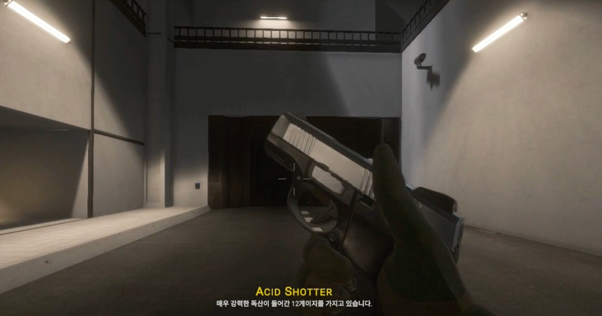
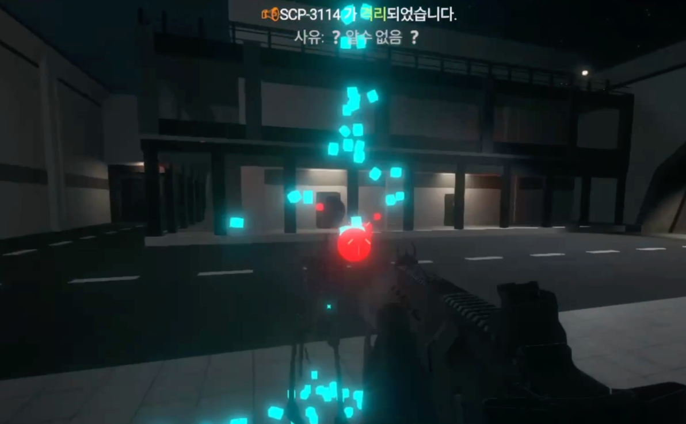
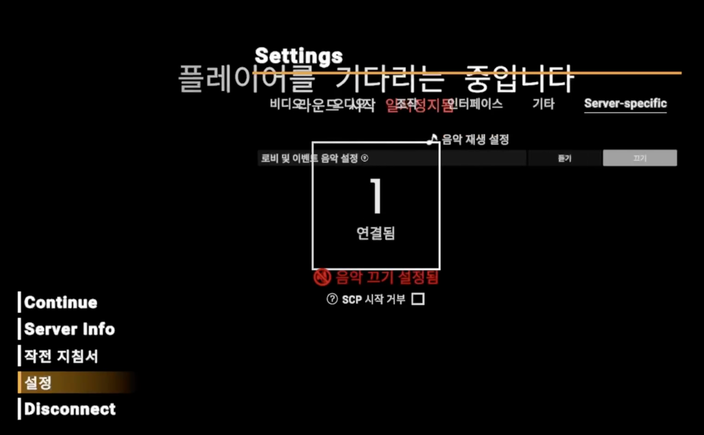
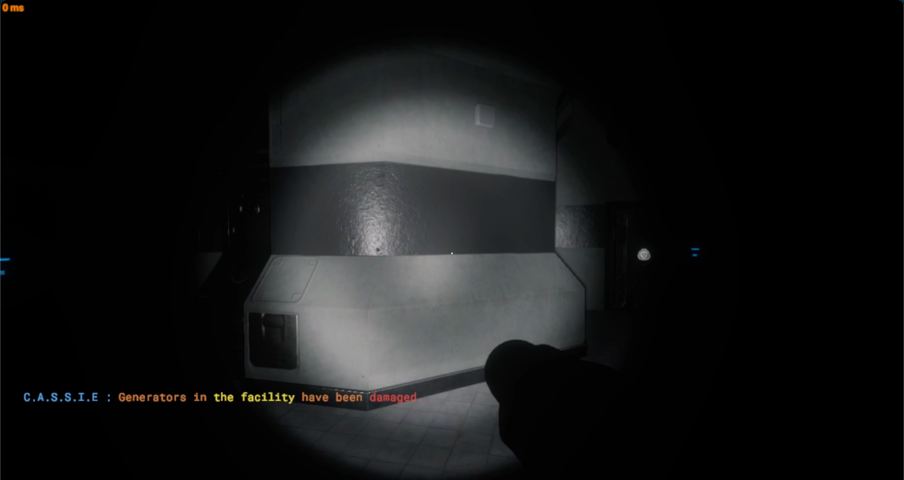
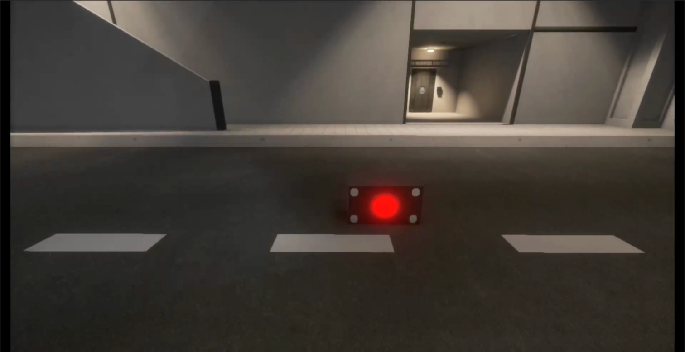

# Ghost Plugin
A comprehensive Exiled plugin for SCP: Secret Laboratory, featuring custom roles, unique weapons, interactive items, multimedia enhancements, and integrations with other community plugins.







<!--## Features
- Integrated custom modules and self-developed methods to extend game logic.
- Injected `Project MER` (DLL-based modules) to manipulate server–client logic at runtime.
    - Utilized the `CreateSchematic()` method to dynamically spawn in-game objects (e.g., shields) in real time at the player’s aiming position.
- Used `HarmonyLib` with `IL injection` to modify compiled bytecode for deeper control.
- Dynamic Music Playback – Supports background music, situational tracks, and jukebox-style area music.
- YouTube Integration – Play audio directly from YouTube URLs (powered by AudioPlayerAPI and youtube-dl/yt-dlp)-->
## Features
- **Custom Items & Weapons** – Special firearms, unique perks, and custom items inspired by Call of Duty.
- **Custom Roles** – Adds new playable roles to diversify SCP:SL gameplay.
- **Special Ammunition System** – Primitive raycast bullets and alternative ammo types.
<!-- **Dynamic Music Playback** – Background music, situational tracks, and jukebox system.-->
- **Classic Subtitles System** – Adds a retro-style subtitle overlay for immersion.
- **Blackout Mode** – Enable or disable map-wide power outages dynamically.
- **Plugin Interoperability** – Works seamlessly with other community plugins (UIU, Serpent’s Hand, etc.).
### Development Process (In-Game Audio System Evolution):
- LobbyMusic – Scene-based background music control (plays only in lobby, auto-stops when match starts).
- Jukebox – Location-based audio playback with interactive control (on/off, summon jukebox).
- MusicPlayback Module  – GhostPlugin  : Music Downloader Integration.•   Applied a Command–Service–Core layered design for scalability and maintainability.
  - Demonstrated advanced proficiency in API design, system integration, and asynchronous programming.
### Implementation Notes
> Music playback is implemented via [AudioPlayerAPI](https://github.com/Killers0992/AudioPlayerApi)
and `youtube-dl`/`yt-dlp` for YouTube URL support.

## Installation
### 🚫 Confidential Notice
> [!WARNING]
> This plugin is proprietary and strictly confidential.
> Installation, redistribution, or public usage is prohibited.
> Authorized use only within designated environments.

You should be install or add dependencies this
- [ProjectMER](https://github.com/Michal78900/ProjectMER/releases/latest)
- [AudioPlayerAPI](https://github.com/Killers0992/AudioPlayerApi)
- [Team Death Match](https://github.com/Hanbin-GW/Team-Deathmatch/releases/latest)
- ReinforceMents (My customized UIU)
- C-Squad (My customized Chaos Version UIU`)
- Invader (My Custom Serpents hand)

#### Also You need to install `yt-dlp`
ubuntu
```bash
sudo wget https://github.com/yt-dlp/yt-dlp/releases/latest/download/yt-dlp -O /usr/local/bin/yt-dlp
sudo chmod a+rx /usr/local/bin/yt-dlp
```
windows
- Download in this link [of Yt-dlp](https://github.com/yt-dlp/yt-dlp/releases)

check a instllation in ubuntu
```bash
yt-dlp --version
```

### Dependencies & APIs

* **Unity (C#)** – game runtime / engine
* **EXILED** – SCP\:SL server modding framework (plugin lifecycle, events)
* **SCPSLAudioApi** – audio playback (AudioPlayer, AudioClipStorage, speakers)
* **Project MER** – runtime DLL modules / object spawn helpers (schematics)
* **HarmonyLib** – IL patching for deep runtime control
* **MEC (More Effective Coroutines)** – lightweight coroutines for server logic
* **yt-dlp** – YouTube audio extraction (bestaudio)
* **FFmpeg** – audio transcode to OGG/Vorbis (48kHz mono)
* **.NET / C# BCL** – `System.IO`, `System.Diagnostics`, `System.Linq`, etc.

> Server paths default to the EXILED plugin data directory. Ensure `yt-dlp` and `ffmpeg` are in `PATH` or configure absolute paths.

### Attribution & Licenses

* **yt-dlp**: open-source (per its license). Updating to the latest release is recommended.
* **FFmpeg**: LGPL/GPL components; your usage (static vs dynamic link, codecs) must comply.
* **EXILED / SCPSLAudioApi / HarmonyLib / MEC / Project MER**: follow each project’s license and attribution requirements.
* **YouTube content**: only download/play material you have the right to use; respect YouTube ToS and local laws.

> This project **inherits/complies** licenses for each dependent item. Obligations may vary depending on distribution type (source/binary) and code link method (static/dynamic), so check the license before distribution.

### Legacy Features (No More Using)
Check this page: [Legacy_Features](GhostPlugin/README/Legacy_Features.md)